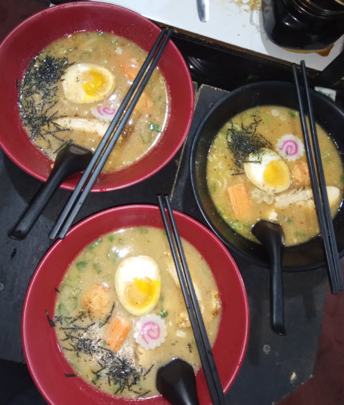

# 🍜 Professional Hospitality & Culinary Portfolio

Welcome to my Professional Hospitality and Culinary Experience showcase! This repository presents my journey in hospitality, admin/managing, and selling various food products including Indonesian-style fried chicken and authentic ramen. I also handled cashier duties, packaging, and online delivery orders.

---

## 📅 Operation Duty

- 👩‍🍳 Role: Admin/Cashier, and Cook Helper
- 📍 Location: Business Centre in Jakarta
- 🛵 Served online delivery & offline customers
- 💰 Online payment ShopeePay/Gopay/Dana/OVO : cashback promo & digital payment

---

## 📸 Portfolio Gallery

### 🍗 Fried Chicken & Rice Business (Ayam Geprek & Ayam Bakar)

  
  

  

  
  
  
  

Fried chicken is served with sambal (spicy sauce) and steamed rice in eco-friendly packaging. Duties included:
- Taking orders
- Frying and assembling dishes
- Handling ShopeePay payment & order logistics

---

### 🍜 Japanese Ramen Menu

Authentic ramen dishes with toppings like:
- Chicken Chashu
- Soft Boiled Eggs
- Narutomaki
- Fishcake
- Seaweed

#### 🍱 Takeaway Ramen Orders

  

#### 🍜 Original Ramen Bowls

  
  
  

#### 🍜 Ramen Shoyu (Soy Sauce Broth)

  

#### 🍜 Ramen with Extra Toppings

  

---

## 📽️ HOSPITALITY APARTEMENT JOB

A video of the booth and the business in action:  
📂 `HOSPITALITY APARTEMENT JOB.mp4` *(not viewable on GitHub preview but stored in repo for download/reference)*

---

## 🎯 Skills Demonstrated

- Customer service & food safety
- Ramen and Indonesian food preparation
- Order packing and visual presentation
- Handling digital payments and promo integration
- Big business and marketing operations

---

## 📞 Contact

Interested in collaborating or hiring? Reach me via email or LinkedIn.  
- 🔗 GitHub Portfolio: [https://sittiaisyahmahmud.github.io/Portfolio/](https://sittiaisyahmahmud.github.io/Portfolio/)
- 🔗 LinkedIn Profile: [https://www.linkedin.com/in/aisyah-mahmud-a5920a234](https://www.linkedin.com/in/aisyah-mahmud-a5920a234/)

Thanks for visiting this portfolio!

